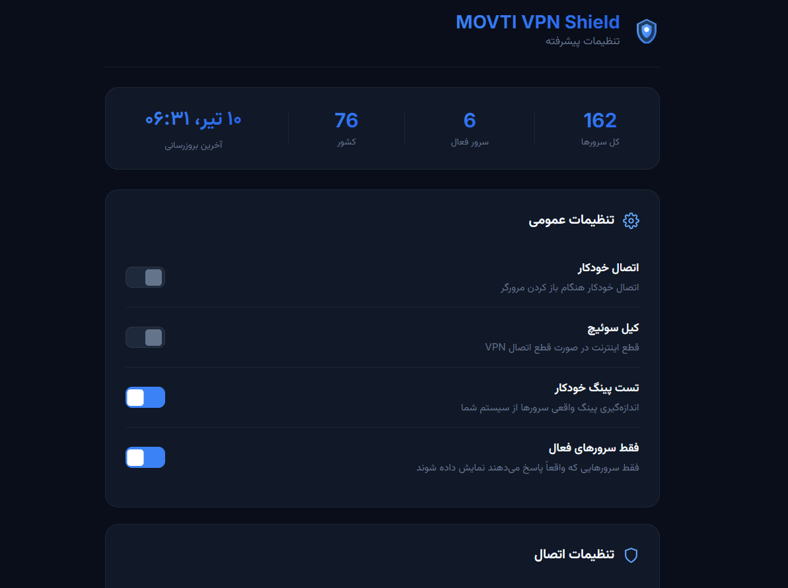
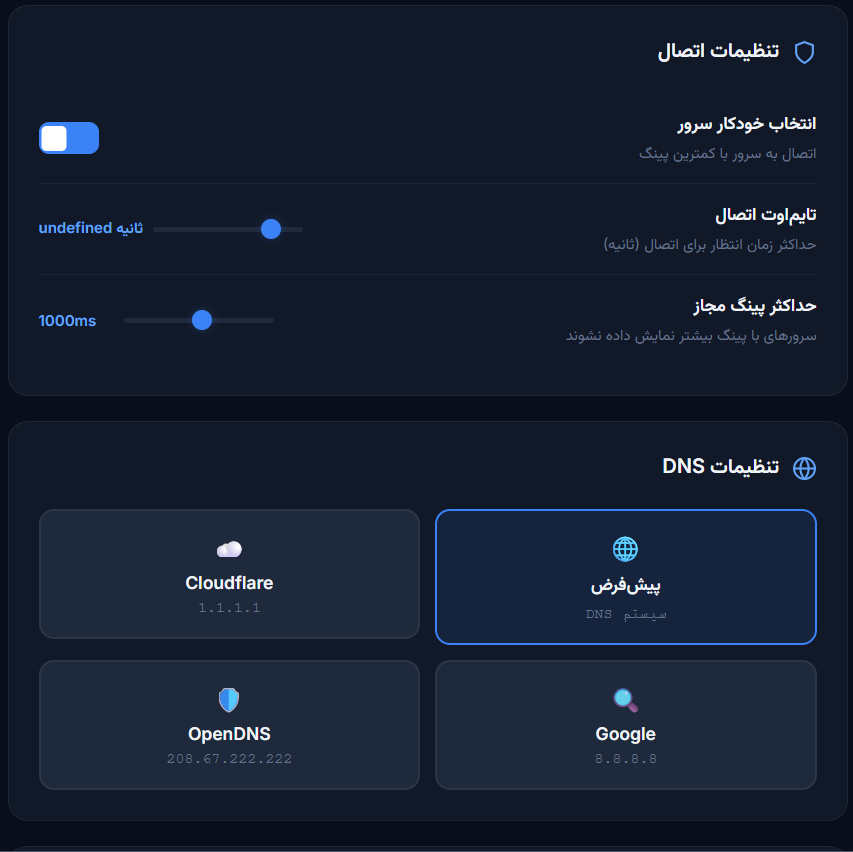
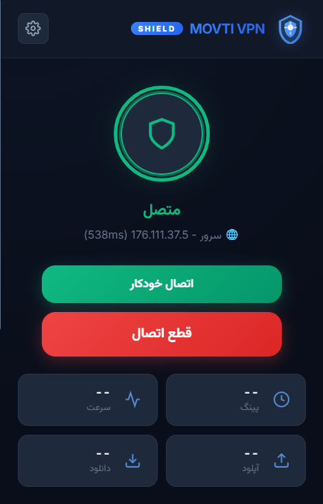

# MOVTIGROUP VPN Extension

[English](README.en.md) | [فارسی](README.fa.md) | [中文](README.zh.md)

<div align="center">
  
  <br>
  
  <br>
  
</div>

This repository contains the main VPN browser extension for **MOVTIGROUP**. Its purpose is to showcase and document the visual design and layout of the website, representing the company's visual identity. Note that the operational code and backend logic are stored privately in a separate repository.

**GitHub Repository:** [https://github.com/movtigroup/movtigroup/](https://github.com/movtigroup/movtigroup/)

## Introduction

This extension serves as the primary visual design for the MOVTIGROUP website. The focus is on delivering a modern, clean, and responsive user experience that reflects the brand identity through its visual components.

## Features

### VPN Extension

- **Responsive Design:** Optimized for various devices including mobile, tablet, and desktop.
- **Easy Customization:** Design elements can be easily adjusted to align with the company's visual identity.
- **User-Friendly Documentation:** A clean and well-documented structure for quick navigation and understanding.
- **Maintainability:** Regular updates and an organized file structure ensure consistent design evolution.

### VPN Extension

- 🔒 Secure connection with one click
- 🌍 300+ servers worldwide
- 📊 Live connection stats (ping, speed, upload, download)
- 🎨 Modern dark theme UI
- 🔄 Auto-update server list
- 🔍 Server search
- ⚙️ Advanced settings (kill switch, DNS, auto-connect)

## Important Notes

- This repository is solely for presenting the visual design and layout components of the website.
- Code related to operational functionality and traffic management is maintained privately in a separate repository.
- Updates, improvements, and design revisions are published here.

## Getting Started

### Prerequisites

- Modern web browser (Chrome, Firefox, Safari, Edge)
- Node.js (for building CRX files)

### Installation

1. Clone the repository:

   ```bash
   git clone https://github.com/movtigroup/movtigroup.git
   ```

2. Navigate to the project directory:
   ```bash
   cd movtigroup
   ```

### Building CRX Files

```bash
# Make the script executable
chmod +x build-crx.sh

# Build all packages
./build-crx.sh all
```

### Installing Extensions

#### Chrome:

1. Open `chrome://extensions/`
2. Enable **Developer mode**
3. Drag and drop the `.crx` file

#### Edge:

1. Open `edge://extensions/`
2. Enable **Developer mode**
3. Drag and drop the `.crx` file

#### Firefox:

1. Open `about:debugging#/runtime/this-firefox`
2. Click **Load Temporary Add-on**
3. Select the `manifest.json` file

## Versioning

This project uses Semantic Versioning. To create a release:

```bash
git tag -a v1.0.0 -m "Release v1.0.0"
git push origin v1.0.0
```

## Usage

Feel free to review the extension files in this repository. For any suggestions or feedback to improve the extension, please use the **Issues** section on GitHub or contact our team directly.

## Contact

- **Email:** [info@movtigroup.ir](mailto:info@movtigroup.ir)
- **Website:** [movtigroup.ir](https://movtigroup.ir)
- **GitHub:** [https://github.com/movtigroup/movtigroup/](https://github.com/movtigroup/movtigroup/)

---

**Version:** 1.0.0 | **Last Updated:** 2025-06-10
